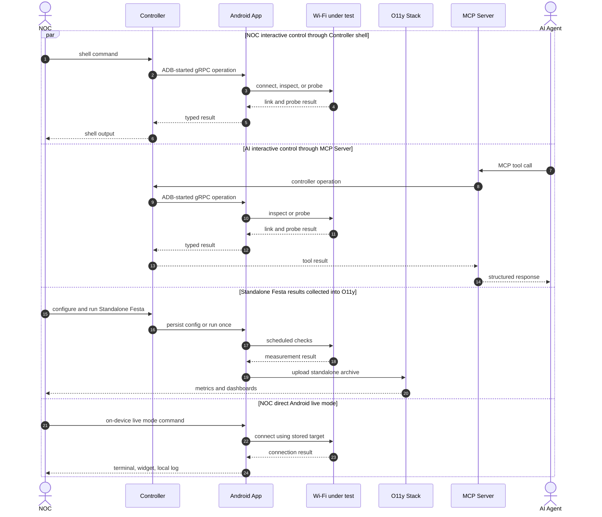

# dropcheck-agent

ADB-controlled Android probes for automated Wi-Fi and access-network checks in event NOCs, built at ShowNet, Interop Tokyo.

## Overview

Dropcheck turns Android handsets into field probes for event NOCs.
Instead of checking connectivity from the infrastructure side, it measures from the same user-facing access network that attendees and staff devices use.

The controller is the operator-facing entry point for live checks and automation.
The agent is the on-device probe, and it can also keep collecting standalone measurements when the controller is absent.
Saved measurements can be exported into the event observability stack for after-the-fact review.



## Requirements

For the Android agent, use an Android 12+ test device with USB debugging enabled. The debug APK is installed over ADB:

```console
$ make install SERIAL=35251JEHN00258
```

Wi-Fi provisioning uses Android privileged Wi-Fi APIs. For `wifi connect`, `wifi cycle`, and `wifi forget`, make the app a device owner on a fresh, unmanaged test device:

```console
$ adb -s 35251JEHN00258 shell dpm set-device-owner io.dropcheck.agent/.DeviceAdminReceiver
```

Grant Wi-Fi visibility permissions, or open the app once and approve the prompts:

```console
$ adb -s 35251JEHN00258 shell pm grant io.dropcheck.agent android.permission.ACCESS_FINE_LOCATION
$ adb -s 35251JEHN00258 shell pm grant io.dropcheck.agent android.permission.ACCESS_BACKGROUND_LOCATION
$ adb -s 35251JEHN00258 shell pm grant io.dropcheck.agent android.permission.NEARBY_WIFI_DEVICES
```

Keep Location enabled on the device; Android hides SSID, BSSID, scan, and MLO details without it.

## Features

Dropcheck has several entry points that share the same typed agent operations.
Use the controller for ad-hoc checks, the shell for field work, MCP for model/tool orchestration, standalone mode for unattended handset-side runs, and Festival when the check should be a repeatable Go test.

### Controller CLI and shell

The controller starts an ADB-backed gRPC session to one or more Android agents.
One-shot CLI commands are scriptable and can emit text or JSON; the interactive shell adds prompts, completion, context help, output filters, and configure/request submodes.

The controller builds three binaries:

```console
$ make build TARGET=controller
+ mkdir -p dist
+ go build -ldflags -X\ dropcheck/controller/internal/version.Version=0.9.0-dirty -o dist/dropcheck ./cmd/dropcheck
+ mkdir -p dist
+ go build -ldflags -X\ dropcheck/controller/internal/version.Version=0.9.0-dirty -o dist/dropcheck-mcp ./cmd/dropcheck-mcp
+ mkdir -p dist
+ go build -ldflags -X\ dropcheck/controller/internal/version.Version=0.9.0-dirty -o dist/dropcheck-ingester ./cmd/dropcheck-ingester
```

`dist/dropcheck` supports:

- **Wi-Fi and IP inspection:** `wifi status`, `wifi diagnostics`, `wifi mlo`, `wifi scan`, `wifi capabilities`, and `ip status`.
- **Wi-Fi control:** `connect`, `disconnect`, `forget`, `wait connected`, `assert`, `reconnect`, and `cycle`.
- **Network probes from the handset:** `ping`, `traceroute`, `path-mtu`, `global-ip`, `dns`, `http`, and `download`.

Common examples:

```console
$ controller/dist/dropcheck --serial R5CT12345 shell
$ controller/dist/dropcheck --serial R5CT12345 --format json show wifi status
$ controller/dist/dropcheck --serial R5CT12345 show wifi scan fresh all --timeout 9000
$ controller/dist/dropcheck --serial R5CT12345 request ping 1.1.1.1 --count 5
```

A short interactive session, with verbose startup lines omitted and network values shown as examples:

```console
$ controller/dist/dropcheck --serial R5CT12345 shell
dropcheck: selected agent=R5CT12345
press '?' for context help, or type 'help' for commands
R5CT12345# show wifi ?
  status                   Current Wi-Fi connection and IP state
  diagnostics              Wi-Fi status, capabilities, networks, and scan
  mlo                      Connected and nearby MLO state
  scan                     Cached or fresh scan results
  capabilities             Device Wi-Fi capabilities
R5CT12345# show wifi status | match "^  (ssid|bssid|band|validated)[[:space:]]"
  ssid                           ShowNet
  bssid                          aa:bb:cc:dd:ee:ff
  band                           6ghz
  validated                      true
R5CT12345# request
R5CT12345(request)# ping 1.1.1.1 count 3 | match "^Ping:"
Ping: host=1.1.1.1 status=ok transmitted=3 received=3 loss=0.0% min/avg/max=10.20/12.40/16.30ms interface=wlan0 elapsed=428ms
R5CT12345(request)# exit
R5CT12345# exit
```

### Android agent

Install the Android agent on a test handset:

```console
$ make install SERIAL=R5CT12345
+ ./gradlew :agent:assembleDebug -PdropcheckVersion=0.9.0-dirty
+ adb -s R5CT12345 install -r -t agent/build/outputs/apk/debug/agent-debug.apk
```

The agent executes controller requests, records structured local logs, renders widgets, and can run a small on-device shell.
Its `use NAME` command connects to Wi-Fi targets configured under the standalone `live` festa, which is useful when a handset is in the field without the controller attached.

Drive the agent from the controller for live measurements:

```console
$ controller/dist/dropcheck --serial R5CT12345 show devices
SEL  #  AGENT    ADB SERIAL  DEVICE              SDK  APP    CONNECTED
*    1  agent-1  R5CT12345   Google Pixel 9      35   0.9.0-dirty  2026-05-06T09:00:00Z

$ controller/dist/dropcheck --serial R5CT12345 show wifi scan fresh all --timeout 9000
Latency: 1420ms
Wi-Fi Scan
  requested_band                 all
  results                        2
  total                          2
  errors                         0
  fresh_scan_wait_completed      true
  fresh_scan_elapsed_ms          1382

SSID     BSSID              RSSI  BAND  FREQ  STANDARD  SECURITY  FLAGS  AP_MLD             AP_LINK  AFFILIATED
ShowNet  aa:bb:cc:dd:ee:ff  -48   6ghz  6135  11be      wpa3_sae  -      02:00:00:00:00:01  1        2
ShowNet  11:22:33:44:55:66  -55   5ghz  5745  11ax      wpa3_sae  -      <none>             -        0

$ controller/dist/dropcheck --serial R5CT12345 request ping 1.1.1.1 --count 5
Latency: 634ms
Ping: host=1.1.1.1 status=ok transmitted=5 received=5 loss=0.0% min/avg/max=10.20/12.40/16.30ms interface=wlan0 elapsed=634ms

5 packets transmitted, 5 received, 0% packet loss
rtt min/avg/max/mdev = 10.200/12.400/16.300/1.900 ms
```

### MCP server

`dist/dropcheck-mcp` runs an MCP stdio server backed by the same controller session machinery.
It exposes tools for session start/stop, agent discovery, Wi-Fi status/scan/connect/wait/assert/cycle, IP status, ping, traceroute, path MTU, global IP, DNS, HTTP, download, standalone config/runs, and a higher-level `dropcheck_run` sequence.

A smoke check can initialize the stdio server and list registered tools without starting an Android session:

```text
$ (
  printf '%s\n' '{"jsonrpc":"2.0","id":1,"method":"initialize","params":{"protocolVersion":"2025-11-25","capabilities":{},"clientInfo":{"name":"readme-smoke","version":"0.1.0"}}}'
  sleep 0.5
  printf '%s\n' '{"jsonrpc":"2.0","method":"notifications/initialized","params":{}}'
  printf '%s\n' '{"jsonrpc":"2.0","id":2,"method":"tools/list","params":{}}'
  sleep 0.5
) | controller/dist/dropcheck-mcp 2>/dev/null \
  | jq -r 'select(.id==1).result.serverInfo.name, (select(.id==2).result.tools[].name | select(. == "dropcheck_session_start" or . == "dropcheck_wifi_status" or . == "dropcheck_ping" or . == "dropcheck_run"))'

dropcheck-mcp
dropcheck_ping
dropcheck_run
dropcheck_session_start
dropcheck_wifi_status
```

Use MCP when another tool should drive Dropcheck without shelling out to the CLI grammar for every operation.
For host-file writes, use the CLI directly: `sync standalone runs` is intentionally not exposed through MCP.

### Standalone measurement and observability

Standalone mode stores "festa" configurations on the handset.
A festa contains Wi-Fi groups to connect to, wait policies, and DNS/ping/HTTP checks.
The agent can run them on a schedule or once on demand, then save a protobuf archive locally.

The controller can inspect and export those archives:

```console
$ controller/dist/dropcheck --serial R5CT12345 request standalone run once --festa shownet --save
$ controller/dist/dropcheck --serial R5CT12345 show standalone runs --limit 5
$ controller/dist/dropcheck --serial R5CT12345 sync standalone runs --output out/standalone --mark-synced
```

For unattended observability, the Android agent uploads standalone archives to MinIO-compatible storage.
`dist/dropcheck-ingester` consumes MinIO notifications or batch backfills, converts archives into metrics, and pushes them to Pushgateway for Prometheus and Grafana.

### Festival DSL

Festival tests are Go tests that connect to a requested Wi-Fi target, wait for the expected link state, run typed checks, and fail with normal Go test output.
The DSL supports retries and stable checks, and it can also evaluate saved standalone archives without a connected Android agent.

Available check builders include Wi-Fi status, MLO diagnostics, scan and scan-detail, Wi-Fi capabilities, IP status, ping, DNS, HTTP, download, traceroute, path MTU, and global IP.

```go
//go:build festival

package festival_test

import (
	"testing"
	"time"

	f "dropcheck/controller/internal/festival"
	"dropcheck/controller/internal/festival/capabilities"
	"dropcheck/controller/internal/festival/dns"
	"dropcheck/controller/internal/festival/ip"
	"dropcheck/controller/internal/festival/ping"
	"dropcheck/controller/internal/festival/scan"
	"dropcheck/controller/internal/festival/wifi"
)

func TestShowNetWiFi(t *testing.T) {
	f.Run(t, f.Plan{
		Name: "shownet-wifi",
		Networks: []f.Network{
			// Connect to one AP, not just any AP advertising the SSID.
			f.WiFi("noc-6ghz").
				SSID("ShowNet").
				BSSID("aa:bb:cc:dd:ee:ff").
				PSKEnv("DROPCHECK_FESTIVAL_WIFI_PSK").
				Security("wpa3").
				Band("6ghz").
				// Wait until Android says the network has validated internet.
				RequireValidated(true).
				WaitTimeout(45 * time.Second).
				// Remove the test network from the handset during cleanup.
				ForgetAfter(true),
		},
		Checks: []f.Check{
			// Check the current Wi-Fi link after association.
			f.WiFiStatus().
				Expect(
					wifi.Enabled().IsTrue(),
					wifi.SSID().Eq("ShowNet"),
					wifi.BSSID().Eq("aa:bb:cc:dd:ee:ff"),
					wifi.Band().Eq("6ghz"),
					wifi.Standard().Eq("be"),
					wifi.TxLinkSpeedMbps().Ge(1000),
					wifi.AssociatedMLOLinkCount().Ge(1),
				).
				Retry(3, 2*time.Second),
			// Force a fresh scan and verify the target AP advertisement.
			f.WiFiScan().
				Fresh().
				Band("6ghz").
				Timeout(10*time.Second).
				Expect(
					scan.ResultCount().Ge(1),
					scan.APs().
						SSID("ShowNet").
						BSSID("aa:bb:cc:dd:ee:ff").
						Standard("be").
						ChannelWidth("320mhz").
						Security("wpa3_sae").
						Exists(),
				),
			// Assert that the handset can run the requested Wi-Fi mode.
			f.WiFiCapabilities().
				Expect(
					capabilities.Band("6ghz").Supported(),
					capabilities.Standard("be").Supported(),
					capabilities.Security("wpa3_sae").Supported(),
				),
			// Check layer-3 provisioning from Android's active network.
			f.IPStatus().
				Expect(
					ip.Validated().IsTrue(),
					ip.Internet().IsTrue(),
					ip.DefaultRoute().IsTrue(),
					ip.DNSServerCount().Ge(1),
					ip.MTU().Ge(1280),
				),
			// Run active reachability checks through the connected Wi-Fi.
			f.Ping("1.1.1.1").
				Count(5).
				Expect(
					ping.Received().Eq(5),
					ping.LossPercent().Eq(0),
					ping.AvgLatency().Le(50*time.Millisecond),
				).
				Retry(2, time.Second),
			// Confirm resolver behavior, not only raw IP reachability.
			f.DNS("www.wide.ad.jp").
				A().
				Expect(
					dns.AnswerCount().Ge(1),
					dns.Elapsed().Le(time.Second),
				),
		},
	})
}
```

```console
$ ADB_SERIAL=R5CT12345 DROPCHECK_FESTIVAL_WIFI_PSK=secret go test -tags festival -run TestShowNetWiFi -v ./integration/festival
=== RUN   TestShowNetWiFi
=== RUN   TestShowNetWiFi/shownet-wifi
=== RUN   TestShowNetWiFi/shownet-wifi/noc-6ghz
=== RUN   TestShowNetWiFi/shownet-wifi/noc-6ghz/connect
=== RUN   TestShowNetWiFi/shownet-wifi/noc-6ghz/wait_connected
=== RUN   TestShowNetWiFi/shownet-wifi/noc-6ghz/wifi_status
=== RUN   TestShowNetWiFi/shownet-wifi/noc-6ghz/wifi_scan_fresh
=== RUN   TestShowNetWiFi/shownet-wifi/noc-6ghz/wifi_capabilities
=== RUN   TestShowNetWiFi/shownet-wifi/noc-6ghz/ip_status
=== RUN   TestShowNetWiFi/shownet-wifi/noc-6ghz/ping_1.1.1.1
=== RUN   TestShowNetWiFi/shownet-wifi/noc-6ghz/dns_www.wide.ad.jp
--- PASS: TestShowNetWiFi (16.84s)
PASS
ok  	dropcheck/controller/integration/festival	17.208s
```

## License

MIT
