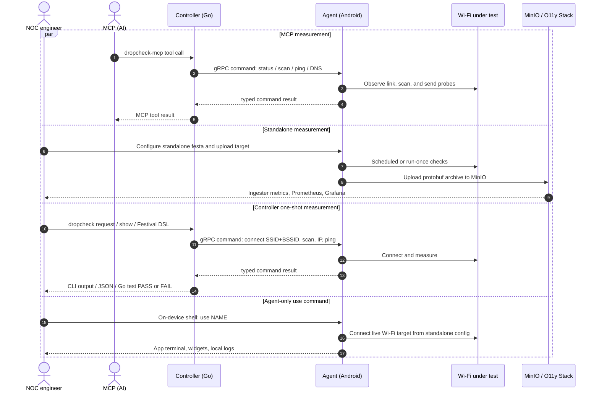

# dropcheck-agent

ADB-controlled Android probes for automated Wi-Fi and access-network checks in event NOCs, built at ShowNet, Interop Tokyo.

## Overview

This repository implements the Android field-probe side of Dropcheck for ShowNet-style event operations. It installs an agent app on Android handsets, controls it from a Go controller, and runs E2E checks from the user-facing access network.

For Wi-Fi drops, the agent verifies association, BSSID pinning, scans, MLO status, IP provisioning, DNS, ping, HTTP, traceroute, path MTU, and global IP through the same client stack used at the venue.

The system has four main pieces:

- Android Agent: installed on test handsets; runs Wi-Fi commands, standalone schedules, local logs, widgets, and the on-device `use NAME` shell for quick field checks.
- Controller: a Go CLI and interactive shell that talks to the agent over ADB-started gRPC sessions and prints text or JSON results.
- Festival DSL: Go test helpers for repeatable venue checks, including SSID/BSSID selection and typed expectations.
- Observability stack: standalone archives are uploaded to MinIO, ingested, and exposed through Pushgateway, Prometheus, and Grafana.



## Requirements

For the Android agent, use an Android 12+ test device with USB debugging enabled. The debug APK is installed over ADB:

```console
$ make install SERIAL=35251JEHN00258
```

Wi-Fi provisioning uses Android privileged Wi-Fi APIs. For `wifi connect`, `wifi cycle`, and `wifi forget`, make the app a device owner on a fresh, unmanaged test device:

```console
$ adb -s 35251JEHN00258 shell dpm set-device-owner io.dropcheck.agent/.DeviceAdminReceiver
```

Grant Wi-Fi visibility permissions, or open the app once and approve the prompts:

```console
$ adb -s 35251JEHN00258 shell pm grant io.dropcheck.agent android.permission.ACCESS_FINE_LOCATION
$ adb -s 35251JEHN00258 shell pm grant io.dropcheck.agent android.permission.ACCESS_BACKGROUND_LOCATION
$ adb -s 35251JEHN00258 shell pm grant io.dropcheck.agent android.permission.NEARBY_WIFI_DEVICES
```

Keep Location enabled on the device; Android hides SSID, BSSID, scan, and MLO details without it.

## Features

### Controller

```console
$ make build TARGET=controller
+ mkdir -p dist
+ go build -ldflags -X\ dropcheck/controller/internal/version.Version=0.9.0-dirty -o dist/dropcheck ./cmd/dropcheck
+ mkdir -p dist
+ go build -ldflags -X\ dropcheck/controller/internal/version.Version=0.9.0-dirty -o dist/dropcheck-mcp ./cmd/dropcheck-mcp
+ mkdir -p dist
+ go build -ldflags -X\ dropcheck/controller/internal/version.Version=0.9.0-dirty -o dist/dropcheck-ingester ./cmd/dropcheck-ingester
```

```console
$ controller/dist/dropcheck --help
Dropcheck controller.

Usage:
  dropcheck [flags] shell [--target TARGET]
  dropcheck [flags] [--format text|json] [--target TARGET|--all] <command>
  dropcheck --version

Commands:
  shell                                 start the interactive controller shell
  show devices                          list connected Android agents
  show config [standalone]              print agent configuration
  show wifi <topic>                     show Wi-Fi status and diagnostics
  show ip status                        show IP and routing status
  show standalone <topic>               show standalone runs and status
  configure <set|delete> ...            edit agent configuration
  clear standalone runs [synced|all]    delete stored runs
  sync standalone runs [options]        download stored standalone runs
  request <command> ...                 run a one-shot agent operation

Examples:
  dropcheck shell
  dropcheck --serial R5CT12345 shell
  dropcheck --format json show devices
  dropcheck request ping 1.1.1.1 --count 5
  dropcheck request wifi scan fresh --timeout 9000
```

### Agent

Install the Android agent on a test handset:

```console
$ make install SERIAL=R5CT12345
+ ./gradlew :agent:assembleDebug -PdropcheckVersion=0.9.0-dirty
+ adb -s R5CT12345 install -r -t agent/build/outputs/apk/debug/agent-debug.apk
```

Drive the agent from the controller:

```console
$ controller/dist/dropcheck --serial R5CT12345 show devices
SEL  #  AGENT    ADB SERIAL  DEVICE              SDK  APP    CONNECTED
*    1  agent-1  R5CT12345   Google Pixel 8 Pro  35   0.9.0-dirty  2026-05-06T09:00:00Z

$ controller/dist/dropcheck --serial R5CT12345 request wifi scan fresh all --timeout 9000
Latency: 1420ms
Wi-Fi Scan
  requested_band                 all
  results                        2
  total                          2
  errors                         0
  fresh_scan_wait_completed      true
  fresh_scan_elapsed_ms          1382

SSID     BSSID              RSSI  BAND  FREQ  STANDARD  SECURITY  FLAGS  AP_MLD             AP_LINK  AFFILIATED
ShowNet  aa:bb:cc:dd:ee:ff  -48   6ghz  6135  11be      wpa3_sae  -      02:00:00:00:00:01  1        2
ShowNet  11:22:33:44:55:66  -55   5ghz  5745  11ax      wpa3_sae  -      <none>             -        0

$ controller/dist/dropcheck --serial R5CT12345 request ping 1.1.1.1 --count 5
Latency: 634ms
Ping: host=1.1.1.1 status=ok transmitted=5 received=5 loss=0.0% min/avg/max=10.20/12.40/16.30ms interface=wlan0 elapsed=634ms

5 packets transmitted, 5 received, 0% packet loss
rtt min/avg/max/mdev = 10.200/12.400/16.300/1.900 ms
```

### Festival DSL

Festival tests are Go tests:

```go
//go:build festival

package festival_test

import (
	"testing"
	"time"

	"dropcheck/controller/internal/festival"
	"dropcheck/controller/internal/festival/capabilities"
	"dropcheck/controller/internal/festival/dns"
	"dropcheck/controller/internal/festival/ip"
	"dropcheck/controller/internal/festival/ping"
	"dropcheck/controller/internal/festival/scan"
	"dropcheck/controller/internal/festival/wifi"
)

func TestShowNetWiFi(t *testing.T) {
	festival.Run(t, festival.Plan{
		Name: "shownet-wifi",
		Networks: []festival.Network{
			// Connect to one AP, not just any AP advertising the SSID.
			festival.WiFi("noc-6ghz").
				SSID("ShowNet").
				BSSID("aa:bb:cc:dd:ee:ff").
				PSKEnv("DROPCHECK_FESTIVAL_WIFI_PSK").
				Security("wpa3").
				Band("6ghz").
				// Wait until Android says the network has validated internet.
				RequireValidated(true).
				WaitTimeout(45 * time.Second).
				// Remove the test network from the handset during cleanup.
				ForgetAfter(true),
		},
		Checks: []festival.Check{
			// Check the current Wi-Fi link after association.
			festival.WiFiStatus().
				Expect(
					wifi.Enabled().IsTrue(),
					wifi.SSID().Eq("ShowNet"),
					wifi.BSSID().Eq("aa:bb:cc:dd:ee:ff"),
					wifi.Band().Eq("6ghz"),
					wifi.Standard().Eq("be"),
					wifi.TxLinkSpeedMbps().Ge(1000),
					wifi.AssociatedMLOLinkCount().Ge(1),
				).
				Retry(3, 2*time.Second),
			// Force a fresh scan and verify the target AP advertisement.
			festival.WiFiScan().
				Fresh().
				Band("6ghz").
				Timeout(10*time.Second).
				Expect(
					scan.ResultCount().Ge(1),
					scan.APs().
						SSID("ShowNet").
						BSSID("aa:bb:cc:dd:ee:ff").
						Standard("be").
						ChannelWidth("320mhz").
						Security("wpa3_sae").
						Exists(),
				),
			// Assert that the handset can run the requested Wi-Fi mode.
			festival.WiFiCapabilities().
				Expect(
					capabilities.Band("6ghz").Supported(),
					capabilities.Standard("be").Supported(),
					capabilities.Security("wpa3_sae").Supported(),
				),
			// Check layer-3 provisioning from Android's active network.
			festival.IPStatus().
				Expect(
					ip.Validated().IsTrue(),
					ip.Internet().IsTrue(),
					ip.DefaultRoute().IsTrue(),
					ip.DNSServerCount().Ge(1),
					ip.MTU().Ge(1280),
				),
			// Run active reachability checks through the connected Wi-Fi.
			festival.Ping("1.1.1.1").
				Count(5).
				Expect(
					ping.Received().Eq(5),
					ping.LossPercent().Eq(0),
					ping.AvgLatency().Le(50*time.Millisecond),
				).
				Retry(2, time.Second),
			// Confirm resolver behavior, not only raw IP reachability.
			festival.DNS("www.wide.ad.jp").
				A().
				Expect(
					dns.AnswerCount().Ge(1),
					dns.Elapsed().Le(time.Second),
				),
		},
	})
}
```

```console
$ ADB_SERIAL=R5CT12345 DROPCHECK_FESTIVAL_WIFI_PSK=secret go test -tags festival -run TestShowNetWiFi -v ./integration/festival
=== RUN   TestShowNetWiFi
=== RUN   TestShowNetWiFi/shownet-wifi
=== RUN   TestShowNetWiFi/shownet-wifi/noc-6ghz
=== RUN   TestShowNetWiFi/shownet-wifi/noc-6ghz/connect
=== RUN   TestShowNetWiFi/shownet-wifi/noc-6ghz/wait_connected
=== RUN   TestShowNetWiFi/shownet-wifi/noc-6ghz/wifi_status
=== RUN   TestShowNetWiFi/shownet-wifi/noc-6ghz/wifi_scan_fresh
=== RUN   TestShowNetWiFi/shownet-wifi/noc-6ghz/wifi_capabilities
=== RUN   TestShowNetWiFi/shownet-wifi/noc-6ghz/ip_status
=== RUN   TestShowNetWiFi/shownet-wifi/noc-6ghz/ping_1.1.1.1
=== RUN   TestShowNetWiFi/shownet-wifi/noc-6ghz/dns_www.wide.ad.jp
--- PASS: TestShowNetWiFi (16.84s)
PASS
ok  	dropcheck/controller/integration/festival	17.208s
```

## License

MIT
