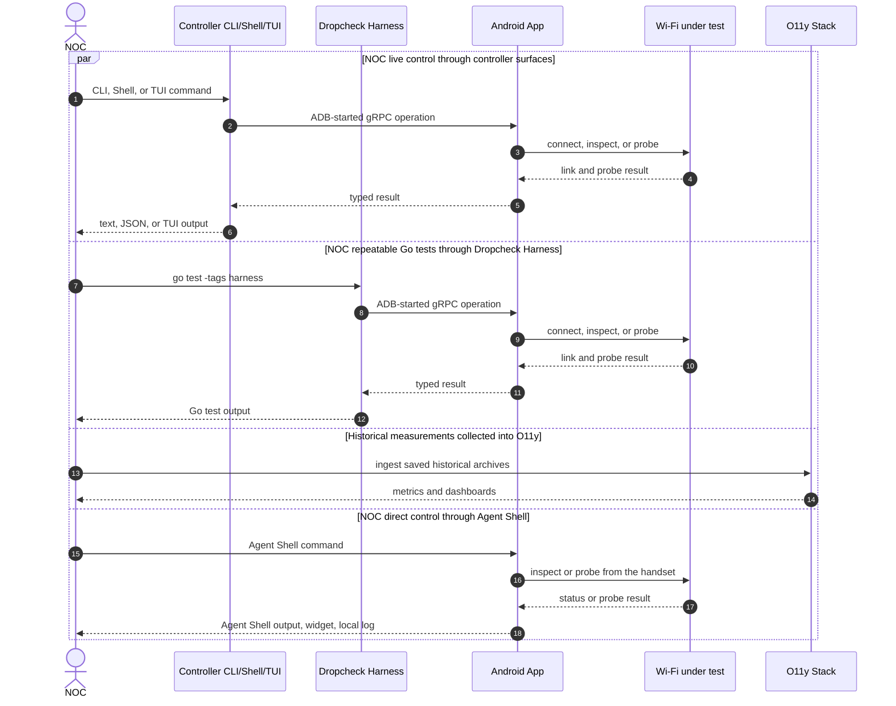

# dropcheck-agent

ADB-controlled Android probes for automated Wi-Fi and access-network end-to-end tests. Born at ShowNet, built for every event NOC.

## Overview

Android handsets act as field probes for event NOCs.
Instead of checking connectivity from the infrastructure side, each check measures from the same user-facing access network that attendees and staff devices use.

The operator-facing surfaces are the one-shot CLI, Controller Shell, Controller TUI, and the Dropcheck Harness.
The harness runs the same typed operations as normal Go tests.
The agent is the on-device probe and hosts Agent Shell for direct handset-side inspection.


```mermaid
sequenceDiagram
  autonumber
  actor NOC as NOC
  participant Controller as Controller CLI/Shell/TUI
  participant Harness as Dropcheck Harness
  participant App as Android App
  participant WiFi as Wi-Fi under test
  participant O11y as O11y Stack

  par NOC live control through controller surfaces
    NOC->>Controller: CLI, Shell, or TUI command
    Controller->>App: ADB-started gRPC operation
    App->>WiFi: connect, inspect, or probe
    WiFi-->>App: link and probe result
    App-->>Controller: typed result
    Controller-->>NOC: text, JSON, or TUI output
  and NOC repeatable Go tests through Dropcheck Harness
    NOC->>Harness: go test -tags harness
    Harness->>App: ADB-started gRPC operation
    App->>WiFi: connect, inspect, or probe
    WiFi-->>App: link and probe result
    App-->>Harness: typed result
    Harness-->>NOC: Go test output
   and Historical measurements collected into O11y
    NOC->>O11y: ingest saved historical archives
    O11y-->>NOC: metrics and dashboards
  and NOC direct control through Agent Shell
    NOC->>App: Agent Shell command
    App->>WiFi: inspect or probe from the handset
    WiFi-->>App: status or probe result
    App-->>NOC: Agent Shell output, widget, local log
  end
```

## Requirements

Building the Android agent requires JDK 17, Android SDK Platform 37, and SDK Build Tools 37.0.0.
The build uses AGP 9.1.1 with its built-in Kotlin support and Gradle 9.3.1, the minimum Gradle version in [AGP 9.1.1's API 37 compatibility matrix](https://developer.android.com/build/releases/agp-9-1-0-release-notes#compatibility).

For the Android agent, use an Android 12+ test device with USB debugging enabled. The debug APK is installed over ADB:

```console
$ make install SERIAL=35251JEHN00258
```

Wi-Fi provisioning uses Android privileged Wi-Fi APIs. For `wifi connect`, `wifi disconnect`, `wifi cycle`, and `wifi forget`, make the app a device owner on a fresh, unmanaged test device.

> [!WARNING]
> Device Owner mode is for dedicated test handsets. Do not enable it on a personal daily-driver device. Android can prevent removing a Device Owner unless the APK is `android:testOnly`; the debug APK installed by `make install` is test-only, but a release or manually modified APK may require a factory reset to remove once it owns the device.

Before setting Device Owner, the device must have no existing Device Owner or Profile Owner, no secondary users, and no local accounts. Removing a Google account from the web is not enough; remove every account from **Settings > Passwords & accounts** on the device, then verify:

```console
$ adb -s 35251JEHN00258 shell dpm list-owners
$ adb -s 35251JEHN00258 shell pm list users
$ adb -s 35251JEHN00258 shell dumpsys account | grep -E 'Accounts:|Account \{'
```

If `dumpsys account` still shows accounts, remove them from device Settings. If Device Owner setup still fails with an already set-up/provisioned-device error, use a freshly factory-reset test device, or reset a test device with Android's test harness mode:

```console
$ adb -s 35251JEHN00258 shell cmd testharness enable
```

`cmd testharness enable` performs a factory reset. After the reset, skip account sign-in during setup, enable USB debugging, install the agent, and set Device Owner:

```console
$ make install SERIAL=35251JEHN00258
$ adb -s 35251JEHN00258 shell dpm set-device-owner io.dropcheck.agent/.DeviceAdminReceiver
$ adb -s 35251JEHN00258 shell dpm list-owners
```

Newly provisioned devices should use `io.dropcheck.agent/.DeviceAdminReceiver`.
Some existing test handsets may still report the legacy component `io.dropcheck.agent/.DropDeviceAdminReceiver`; keep using the component shown by `dpm list-owners` for teardown on those devices.

For debug APKs installed by `make install`, Device Owner can usually be removed during test teardown with:

```console
$ adb -s 35251JEHN00258 shell dpm list-owners
$ adb -s 35251JEHN00258 shell dpm remove-active-admin <component-from-list-owners>
```

Grant Wi-Fi visibility permissions, or open the app once and approve the prompts:

```console
$ adb -s 35251JEHN00258 shell pm grant io.dropcheck.agent android.permission.ACCESS_FINE_LOCATION
$ adb -s 35251JEHN00258 shell pm grant io.dropcheck.agent android.permission.ACCESS_BACKGROUND_LOCATION
$ adb -s 35251JEHN00258 shell pm grant io.dropcheck.agent android.permission.NEARBY_WIFI_DEVICES
```

Keep Location enabled on the device; Android hides SSID, BSSID, scan, and MLO details without it.

### Controller service caller boundary

`AgentService` remains exported for `adb shell am start-foreground-service`, but Android checks
`android.permission.DUMP` on the original caller **before** delivering a start intent, even when
the service is already running. The platform shell holds this permission; Android also allows
the component's own UID, so clock-widget start/stop needs no extra grant. The agent does not
request DUMP. Ordinary installed apps cannot obtain it through a runtime permission prompt.
Platform/privileged apps and apps explicitly granted this development permission by an ADB
operator are trusted callers too; do not grant DUMP to untrusted apps. Device Owner alone is
not the service-start authorization, and the gRPC token does not replace this caller boundary.

This uses the platform's [DUMP declaration](https://android.googlesource.com/platform/frameworks/base/+/android-16.0.0_r1/core/res/AndroidManifest.xml)
(`signature|privileged|development`), [shell grant](https://android.googlesource.com/platform/frameworks/base/+/android-12.0.0_r1/packages/Shell/AndroidManifest.xml),
and [component UID/permission check](https://android.googlesource.com/platform/frameworks/base/+/android-12.0.0_r1/core/java/android/app/ActivityManager.java).
No caller UID is inferred from `onStartCommand`, which is dispatched by the system.

Device checks are still required on dedicated API 31/32 and current supported handsets.
Build the minimal native instrumentation APK with `./gradlew :agent:assembleDebugAndroidTest`.
After installing both debug APKs, run these **device-only** checks:

```sh
adb shell am start -W -n io.dropcheck.agent.test/io.dropcheck.agent.UntrustedServiceCallerActivity
adb shell run-as io.dropcheck.agent.test cat files/service-caller-result
adb shell am instrument -w io.dropcheck.agent.test/io.dropcheck.agent.ServiceSameUidInstrumentation
```

The test activity runs in its own test package (a separate UID with no DUMP grant) and requires
permission-specific denial for controller and widget intents. Run it once with the service
stopped and again while a normal controller session is active; the latter session must retain
its connection and continue a harmless status command, with no superseded-session event.
The native instrumentation targets the agent UID and exercises widget observer start/stop only.
Run instrumentation separately from the active-session denial check: Android can restart the
instrumented app. The standalone denial activity does not instrument or restart the agent.
Separately run the normal controller `show wifi status` ADB flow twice to verify authorized
start and session replacement. FGS lifecycle/permissions and actual widget updates must also
remain healthy; a background-start restriction alone is not evidence of caller authorization.

### Wi-Fi Network identity

Per-Network status, SSID selectors, widgets, and event logs use WifiInfo associated with that
exact Android `Network`. On-demand capabilities redact location-sensitive identity on API 31+;
when necessary, a location-inclusive network callback obtains the associated snapshot with a
one-second bound and unregisters after each lookup. It never assigns global
`WifiManager.connectionInfo` to another Network or keeps an inferred identity cache.
This follows the platform's [on-demand redaction and callback contract](https://android.googlesource.com/platform/packages/modules/Connectivity/+/refs/heads/android12-release/framework/src/android/net/ConnectivityManager.java).
The existing Location/visibility grants remain required. Missing/redacted identity is logged
as `wifi.identity.unavailable`; that candidate is explicitly rejected, while selection continues
to any known matching Network. If no match can be selected and a candidate's identity is unknown,
the specific SSID selector fails with an identity-unavailable error rather than guessing.
A blank selector needs no SSID identity. VPNs may report their underlying Wi-Fi transport but are not physical Wi-Fi
candidates; their IP status must not inherit the underlying network's WifiInfo.

## Features

The controller/agent toolchain has several entry points that share the same typed agent operations.
Use the one-shot controller CLI for ad-hoc checks, Controller Shell for field work, Controller TUI (`dropcheck watch`) for continuous loops, Agent Shell for on-device inspection, and Dropcheck Harness when the check should be a repeatable Go test.

### Controller Shell

The controller starts an ADB-backed gRPC session to one or more Android agents.
One-shot CLI commands are scriptable and can emit text or JSON.
Controller Shell adds prompts, completion, context help, output filters, and request mode on top of the same typed agent operations. Configure mode retains `run show ...` and `run request ...`; obsolete standalone configuration commands are no longer available.

The controller builds two host-side binaries:

```console
$ make build TARGET=controller
+ mkdir -p dist
+ go build -ldflags -X\ dropcheck/controller/internal/version.Version=0.9.0-dirty -o dist/dropcheck ./cmd/dropcheck
+ mkdir -p dist
+ go build -ldflags -X\ dropcheck/controller/internal/version.Version=0.9.0-dirty -o dist/dropcheck-ingester ./cmd/dropcheck-ingester
```

`dist/dropcheck` supports:

- **Wi-Fi and IP inspection:** `wifi status`, `wifi diagnostics`, `wifi eht`, `wifi scan`, `wifi capabilities`, and `ip status`.
- **Wi-Fi control:** `connect`, `disconnect`, `forget`, `wait connected`, `assert`, `reconnect`, and `cycle`.
- **Network probes from the handset:** `ping`, `traceroute`, `path-mtu`, `global-ip`, `dns`, `http`, and `download`.

Common examples:

```console
$ controller/dist/dropcheck --serial R5CT12345 shell
$ controller/dist/dropcheck --serial R5CT12345 --format json show wifi status
$ controller/dist/dropcheck --serial R5CT12345 show wifi scan fresh all --timeout 9000
$ controller/dist/dropcheck --serial R5CT12345 request ping 1.1.1.1 --count 5
```

In text mode, `show wifi status` appends controller-side ADB IPv6 RA diagnostics when the selected handset is reachable over ADB.
That `ADB IPv6 RA` block shows `accept_ra*`, IPv6 default-route presence, and decoded router advertisements with `router_lifetime`, `valid_lifetime`, and `preferred_lifetime`, which is useful when SLAAC addresses appear but IPv6 internet access or the default router is missing.

A short interactive session, with verbose startup lines omitted and network values shown as examples:

```console
$ controller/dist/dropcheck --serial R5CT12345 shell
dropcheck: selected agent=R5CT12345
press '?' for Controller Shell context help, or type 'help' for commands
R5CT12345# show wifi ?
  status                   Current Wi-Fi connection and IP state
  diagnostics              Wi-Fi status, capabilities, networks, and scan
  eht                      Connected and nearby EHT state
  scan                     Cached or fresh scan results
  capabilities             Device Wi-Fi capabilities
R5CT12345# show wifi status | match "^  (ssid|bssid|band|validated)[[:space:]]"
  ssid                           ShowNet
  bssid                          aa:bb:cc:dd:ee:ff
  band                           6ghz
  validated                      true
R5CT12345# request
R5CT12345(request)# ping 1.1.1.1 count 3 | match "^Ping:"
Ping: host=1.1.1.1 status=ok transmitted=3 received=3 loss=0.0% min/avg/max=10.20/12.40/16.30ms interface=wlan0 elapsed=428ms
R5CT12345(request)# exit
R5CT12345# exit
```

### Android Agent and Agent Shell

Install the Android agent on a test handset:

```console
$ make install SERIAL=R5CT12345
+ ./gradlew :agent:assembleDebug -PdropcheckVersion=0.9.0-dirty
+ adb -s R5CT12345 install -r -t agent/build/outputs/apk/debug/agent-debug.apk
```

The Android agent executes controller requests, records structured local logs, renders widgets, and hosts Agent Shell for direct handset-side inspection.
Agent Shell focuses on local Wi-Fi inspection plus handset-side probes such as `ping` and `traceroute`.
For direct handset-side joins, `set default passphrase <psk>` stores a default PSK for later `use <ssid>`, and `use <ssid> <psk>` overrides it per command.
Wrap SSIDs or PSKs in double quotes when they contain spaces or other shell-significant characters.

Drive the agent from the controller for live measurements:

```console
$ controller/dist/dropcheck --serial R5CT12345 show devices
SEL  #  AGENT    ADB SERIAL  DEVICE              SDK  APP    CONNECTED
*    1  agent-1  R5CT12345   Google Pixel 9      35   0.9.0-dirty  2026-05-06T09:00:00Z

$ controller/dist/dropcheck --serial R5CT12345 show wifi scan fresh all --timeout 9000
Latency: 1420ms
Wi-Fi Scan
  requested_band                 all
  results                        2
  total                          2
  errors                         0
  fresh_scan_wait_completed      true
  fresh_scan_elapsed_ms          1382

SSID     BSSID              RSSI  BAND  FREQ  STANDARD  SECURITY  FLAGS  AP_MLD             AP_LINK  AFFILIATED
ShowNet  aa:bb:cc:dd:ee:ff  -48   6ghz  6135  11be      wpa3_sae  -      02:00:00:00:00:01  1        2
ShowNet  11:22:33:44:55:66  -55   5ghz  5745  11ax      wpa3_sae  -      <none>             -        0

$ controller/dist/dropcheck --serial R5CT12345 request ping 1.1.1.1 --count 5
Latency: 634ms
Ping: host=1.1.1.1 status=ok transmitted=5 received=5 loss=0.0% min/avg/max=10.20/12.40/16.30ms interface=wlan0 elapsed=634ms

5 packets transmitted, 5 received, 0% packet loss
rtt min/avg/max/mdev = 10.200/12.400/16.300/1.900 ms
```

### Controller TUI

`dropcheck watch` starts the Controller TUI and runs a continuous E2E Wi-Fi test loop from the controller.
It is meant for field operation: connection failures and failed `required: true` checks skip the remaining checks for that target, other check failures are recorded as findings, and the next target and round continue.
Use `--jsonl` when you also want an append-only event log.
When multiple agents are connected, unassigned targets run on every selected agent.
Set `agent:` on a target to bind it to one Android agent by ADB serial; a unique serial prefix is accepted, while device model names are display-only in the YAML plan.

```console
$ controller/dist/dropcheck --serial R5CT12345 watch -c examples/watch.yml --jsonl watch.jsonl
```

```yaml
version: 1
name: shownet-watch
round_interval: 0s

defaults:
  passphrase_env: DROPCHECK_WIFI_PSK
  security: wpa3
  # Use non-persistent plus mac_rotation when each target or round should get a
  # fresh randomized MAC. Supported rotations are none, per_target, and per_round.
  mac_randomization: non-persistent
  mac_rotation: per_target
  require_ip: true
  require_validated: true
  disconnect_after: true
  forget_after: true

targets:
  - name: noc-6g-ap1
    # Optional: bind this target to one connected agent by ADB serial.
    # A unique serial prefix is accepted; device model names are display-only.
    # agent: R5CT12345
    ssid: ShowNet
    bssid: aa:bb:cc:dd:ee:ff
    band: 6ghz

checks:
  - name: wifi link
    type: wifi_status
    expect:
      ssid: ShowNet
      band: 6ghz
  - name: ip
    type: ip_status
    required: true
    timeout: 45s
    expect:
      validated: true
      default_route: true
      ipv4_default_route: true
      dns_server_count: ">=1"
      mtu: ">=1280"
      ipv4_addresses:
        cidr: 192.168.20.0/22
      ipv4_dns_servers:
        cidr: 192.168.20.0/22
        mode: at_least
  - name: ping cloudflare
    type: ping
    host: one.one.one.one
    family: ipv4
    count: 5
    expect:
      received: 5
      loss_percent: 0
  - name: dns cloudflare
    type: dns
    query: one.one.one.one
    record: A
    expect:
      a_answers:
        exact:
          - 1.0.0.1
          - 1.1.1.1
```

For `ping`, `traceroute`, and `path_mtu`, `family: ipv4` or `family: ipv6` pins a dual-stack hostname probe to one address family.
Leave `family` unset when the agent should auto-select based on DNS answers and usable source addresses.

### Historical archives and observability

Android standalone scheduling, run-once, storage retrieval, and upload control have
been removed. The controller no longer exposes standalone commands or `show config`.
Use Controller TUI/watch or Dropcheck Harness for current measurements.

Saved historical standalone protobuf archives remain supported for offline Harness
replay and ingestion. `dist/dropcheck-ingester` consumes stored archives through
MinIO notifications or batch backfills, converts them into metrics, and pushes them
to Pushgateway for Prometheus and Grafana. This does not require or restore Android
standalone mode.

Backfill streams the MinIO listing rather than retaining every object reference.
It reports total failures with at most ten example errors, retries failed objects,
and removes deleted-object deduplication signatures only after a complete listing.
Incomplete/canceled listings preserve that state; concurrent notifications refresh it.
Latest-measurement fences remain per stable group even when its objects are deleted.

The synthetic scale-check envelope is 1,000–100,000 retained archives per configured
prefix, with five steps and one stable group, not a production RSS guarantee.
At 100,000 objects, sampled initial heap growth was about 51 MB; replacing all keys
kept 100,000 cached signatures instead of accumulating 200,000. All-fetch-failure
error output stayed below 1 KB instead of growing to 6.6 MB. Allocation totals are
not retained heap, and a retention scan may temporarily hold both generations.
Deduplication memory still scales with retained keys plus notifications since the
last complete scan; ordering state scales with stable groups. Choose object-store
lifecycle retention/prefix scope to fit the deployment's memory budget. The ingester
does not delete archives or impose a new archive-count cap. The existing per-object
64 MiB limit does not bound total heap or concurrent notification payloads.
Reproduce the scale check from `controller/`:

```sh
go test -p 1 ./internal/ingester -run '^$' -bench '^BenchmarkBackfillScale$' -benchtime=1x -benchmem
```

### Dropcheck Harness

Dropcheck Harness is a Go test harness for ADB-backed Android network checks.
Harness tests connect to a requested Wi-Fi target, wait for the expected link state, run typed checks, and fail with normal Go test output.
Live checks support retries and stability checks. Offline replay consumes distinct
saved observations for repetition and retries; `StableFor` requires live measurements.

Available check builders include Wi-Fi status, EHT diagnostics, scan and scan-detail, Wi-Fi capabilities, IP status, ping, DNS, HTTP, download, traceroute, path MTU, and global IP.

```go
//go:build harness

package harness_test

import (
	"testing"
	"time"

	h "dropcheck/controller/internal/harness"
	"dropcheck/controller/internal/harness/capabilities"
	"dropcheck/controller/internal/harness/dns"
	"dropcheck/controller/internal/harness/ip"
	"dropcheck/controller/internal/harness/ping"
	"dropcheck/controller/internal/harness/scan"
	"dropcheck/controller/internal/harness/wifi"
)

func TestShowNetWiFi(t *testing.T) {
	h.Run(t, h.Plan{
		Name: "shownet-wifi",
		Networks: []h.Network{
			// Connect to one AP, not just any AP advertising the SSID.
			h.WiFi("noc-6ghz").
				SSID("ShowNet").
				BSSID("aa:bb:cc:dd:ee:ff").
				PSKEnv("DROPCHECK_HARNESS_WIFI_PSK").
				Security("wpa3").
				Band("6ghz").
				// Wait until Android says the network has validated internet.
				RequireValidated(true).
				WaitTimeout(45 * time.Second).
				// Remove the test network from the handset during cleanup.
				ForgetAfter(true),
		},
		Checks: []h.Check{
			// Check the current Wi-Fi link after association.
			h.WiFiStatus().
				Expect(
					wifi.Enabled().IsTrue(),
					wifi.SSID().Eq("ShowNet"),
					wifi.BSSID().Eq("aa:bb:cc:dd:ee:ff"),
					wifi.Band().Eq("6ghz"),
					wifi.Standard().Eq("be"),
					wifi.TxLinkSpeedMbps().Ge(1000),
					wifi.AssociatedMLOLinkCount().Ge(1),
				).
				Retry(3, 2*time.Second),
			// Force a fresh scan and verify the target AP advertisement.
			h.WiFiScan().
				Fresh().
				Band("6ghz").
				Timeout(10*time.Second).
				Expect(
					scan.ResultCount().Ge(1),
					scan.APs().
						SSID("ShowNet").
						BSSID("aa:bb:cc:dd:ee:ff").
						Standard("be").
						ChannelWidth("320mhz").
						Security("wpa3_sae").
						Exists(),
				),
			// Assert that the handset can run the requested Wi-Fi mode.
			h.WiFiCapabilities().
				Expect(
					capabilities.Band("6ghz").Supported(),
					capabilities.Standard("be").Supported(),
					capabilities.Security("wpa3_sae").Supported(),
				),
			// Check layer-3 provisioning from Android's active network.
			h.IPStatus().
				Expect(
					ip.Validated().IsTrue(),
					ip.Internet().IsTrue(),
					ip.DefaultRoute().IsTrue(),
					ip.DNSServerCount().Ge(1),
					ip.MTU().Ge(1280),
				),
			// Run active reachability checks through the connected Wi-Fi.
			h.Ping("1.1.1.1").
				Count(5).
				Expect(
					ping.Received().Eq(5),
					ping.LossPercent().Eq(0),
					ping.AvgLatency().Le(50*time.Millisecond),
				).
				Retry(2, time.Second),
			// Confirm resolver behavior, not only raw IP reachability.
			h.DNS("www.wide.ad.jp").
				A().
				Expect(
					dns.AnswerCount().Ge(1),
					dns.Elapsed().Le(time.Second),
				),
		},
	})
}
```

```console
$ cd controller
$ ADB_SERIAL=R5CT12345 DROPCHECK_HARNESS_WIFI_PSK=secret go test -tags harness -run TestShowNetWiFi -v ./integration/harness
=== RUN   TestShowNetWiFi
=== RUN   TestShowNetWiFi/shownet-wifi
=== RUN   TestShowNetWiFi/shownet-wifi/noc-6ghz
=== RUN   TestShowNetWiFi/shownet-wifi/noc-6ghz/connect
=== RUN   TestShowNetWiFi/shownet-wifi/noc-6ghz/wait_connected
=== RUN   TestShowNetWiFi/shownet-wifi/noc-6ghz/wifi_status
=== RUN   TestShowNetWiFi/shownet-wifi/noc-6ghz/wifi_scan_fresh
=== RUN   TestShowNetWiFi/shownet-wifi/noc-6ghz/wifi_capabilities
=== RUN   TestShowNetWiFi/shownet-wifi/noc-6ghz/ip_status
=== RUN   TestShowNetWiFi/shownet-wifi/noc-6ghz/ping_1.1.1.1
=== RUN   TestShowNetWiFi/shownet-wifi/noc-6ghz/dns_www.wide.ad.jp
--- PASS: TestShowNetWiFi (16.84s)
PASS
ok  	dropcheck/controller/integration/harness	17.208s
```

## Controller unit tests

Controller unit tests use temporary fake ADB executables, not connected devices.
Their bounded success checks include OS scheduling, shell startup, and, for session
tests, multiple process launches plus the local gRPC handshake. On shared or busy
hosts, run only one controller test invocation at a time and run its Go packages
serially so competing package builds/tests do not consume those budgets:

```console
$ make test TARGET=controller GOFLAGS=-p=1
$ cd controller
$ go test -p 1 -race -count=1 ./...
$ go test -p 1 -race -count=10 ./internal/adb ./internal/session ./internal/app
```

`-p 1` limits this invocation's package parallelism; it does not serialize other
test jobs or disable concurrent controller code and the race detector.
Fake-process timeout/cancellation tests still run and report elapsed time, timeout
state, and exit status with `-v`. `TestFakeADBLaunchDiagnostics` separates process
creation from completion for a shell-builtin-only fixture; the cancellation check
waits for an explicit startup marker before canceling and verifies that the child
is reaped. Keep existing success-check deadlines and production ADB timeouts
intact; investigate these diagnostics and competing jobs before extending a
timeout. Run non-live E2E with `DROPCHECK_E2E_LIVE` unset.

## Protobuf binding generation

The shared schema is `proto/dropcheck/v1/control.proto`. Go bindings are committed
under `controller/internal/controlpb`; Android generates its bindings through
Gradle using the versions in `agent/build.gradle.kts`.

For Go generation, install **protoc 35.0** from the
[official release](https://github.com/protocolbuffers/protobuf/releases/tag/v35.0):
download the `protoc-35.0-<platform>.zip` matching your OS and architecture,
verify its SHA-256 against the release asset digest, extract it, and put its `bin`
directory on `PATH` (or set `PROTOC` to the extracted executable).
`protoc --version` must print `libprotoc 35.0`.
Go must meet `controller/go.mod`'s requirement. From the repository root:

```sh
make generate-go
git diff -- controller/internal/controlpb
make generate-go
git diff -- controller/internal/controlpb
make test TARGET=controller
```

The target rejects other protoc versions and installs pinned `protoc-gen-go`
**v1.36.1** and `protoc-gen-go-grpc` **v1.3.0** into a temporary directory, removed
on exit. It needs network access on first use; no globally installed Go plugins
are required. These generator versions intentionally preserve the existing Go
API and are independent of the newer runtime dependencies. The include root is
`proto/dropcheck/v1`, so the descriptor source stays `control.proto`;
`paths=source_relative` maps both outputs directly into `controlpb`.
Do not hand-edit generated files.

The initial regeneration restores two generator-emitted spellings:
`reflect.TypeOf(x{})` instead of `reflect.TypeFor[x]()`, and `interface{}` instead
of `any`. They do not change the Go API, descriptors, or wire format.

Unchanged-schema generation must produce identical bytes on the second run.
From a clean checkout, a generation-drift check is:

```sh
make generate-go
git diff --exit-code -- controller/internal/controlpb
```

CI can run this once its owner provisions the pinned protoc and Go tools.
For schema edits, reserve both removed field numbers and names, preserve enum
numbers and archive/wire compatibility, regenerate Go, and validate both
consumers with `make test TARGET=controller` and
`make build test TARGET=agent`. The Android tasks regenerate through Gradle;
do not use the host Go generator versions to override Android's toolchain.
Go-only workflow maintenance does not require an Android schema change.

## Continuous integration

`.github/workflows/ci.yml` runs on pushes and pull requests. It also supports
an explicitly authorized manual run on a safe branch. Jobs use Ubuntu 24.04,
immutable action revisions, Go 1.26.8, staticcheck v0.7.0, and Temurin JDK
17.0.20.1+1. Android SDK platform 37 (`platforms;android-37.0`) and Build Tools
37.0.0 match the agent's Gradle configuration; target SDK remains 36. Gradle and
application dependency versions come from the committed wrapper and build
files. Update CI provisioning alongside any changes to those toolchain requirements.

The controller job runs `make fmt-check`, `make build TARGET=controller`,
`make test TARGET=controller`, `make lint TARGET=controller`, and
`go test -race -count=1 ./...` from `controller/`. Job-wide `GOFLAGS=-p=1`
serializes package work for tool installation, build, tests, vet, staticcheck,
and race checks. Each GitHub-hosted job has its own runner; local controller
checks must also run one job at a time per host with `GOFLAGS=-p=1`.
The formatting gate is read-only and excludes generated
`controller/internal/controlpb` files, matching `make fmt TARGET=controller`;
it does not run the source-rewriting
`make quality` target. The Android job runs the existing agent build,
unit-test, and lint Make targets with the SDK installed. No secrets, connected
handset, or Wi-Fi credentials are needed by either job.

Docker-backed `make integration` is an explicit, separate check: it needs a
Docker daemon and disposable MinIO containers, and is not run by this workflow.
Publicly pullable, tested image pins must be established separately (issue #24).
Run it in an authorized isolated environment when changing ingestion or
container images; a skipped MinIO test is not a successful integration check.
Live `make e2e` and `-tags harness` device tests are excluded: they require
dedicated authorized handsets and network credentials, never an ordinary PR
runner. Regression tests in the normal controller and Android unit-test suites
run automatically without adding special workflow filters.

## License

MIT
